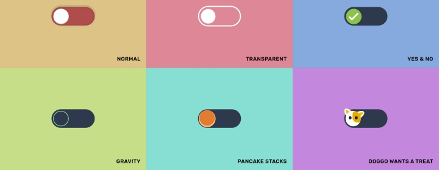
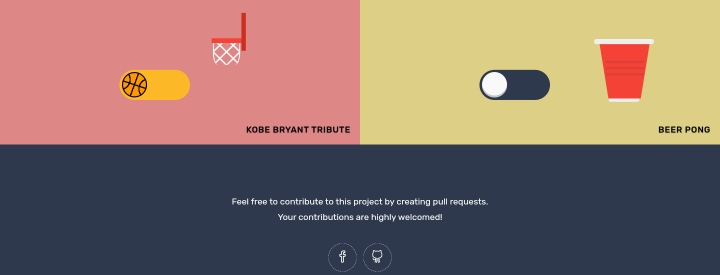

# Interactive Toggle Buttons

## Introduction
Welcome to the Interactive Toggle Buttons project! This repository contains a collection of creatively designed toggle buttons with various styles and animations.

## Preview
[Toggle Buttons Preview](https://johndev19.github.io/Interactive-Toggle-Buttons/)

## Table of Contents
- [Getting Started](#getting-started)
- [Contributing](#contributing)
- [License](#license)
- [Contact](#contact)

## Getting Started
To get started with the Interactive Toggle Buttons, follow these steps:

1. Clone the repository: `git clone https://github.com/YourUsername/interactive-toggle-buttons.git`
2. Open the `index.html` file in your preferred web browser.
3. Explore and interact with the different toggle buttons.

## Contributing
I welcome contributions. If you'd like to contribute to this project, please follow these guidelines:

1. Fork the repository.
2. Create a new branch: `git checkout -b feature/new-feature`.
3. Make your changes and commit them: `git commit -m 'Add new feature'`.
4. Push to the branch: `git push origin feature/new-feature`.
5. Submit a pull request.

I appreciate your contributions!

## License
This project is licensed under the [MIT License](LICENSE).

## Contact
If you have any questions or suggestions, feel free to reach out:
- Facebook: [@JohnDev19](https://www.facebook.com/IamJohnPoras.org)
- GitHub: [JohnDev19](https://github.com/JohnDev19)
